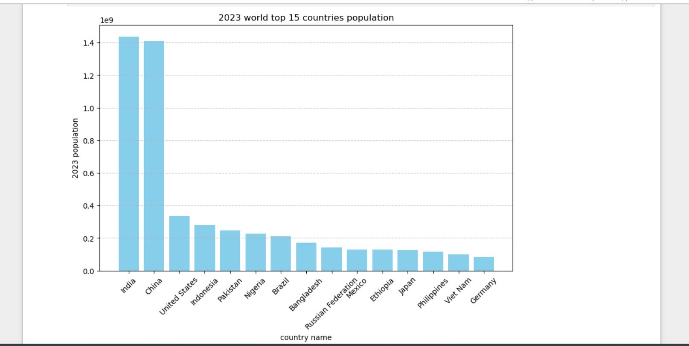
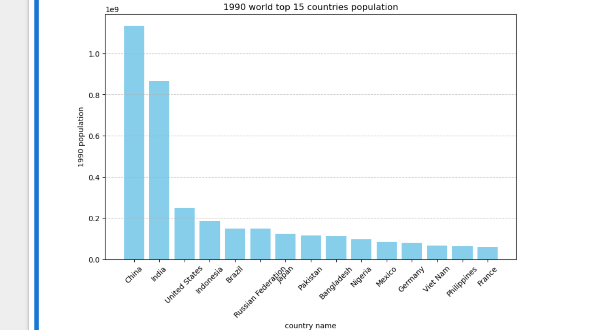
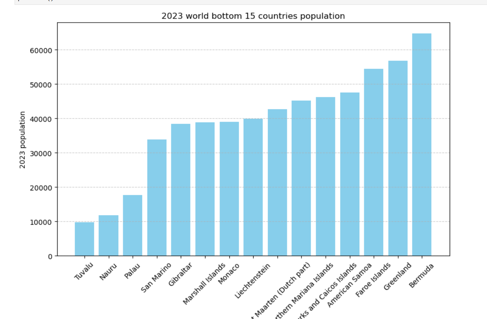
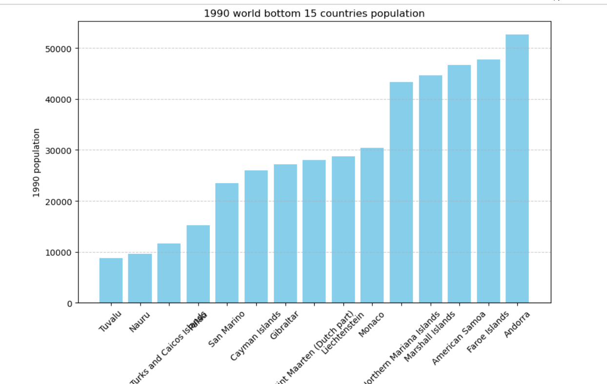
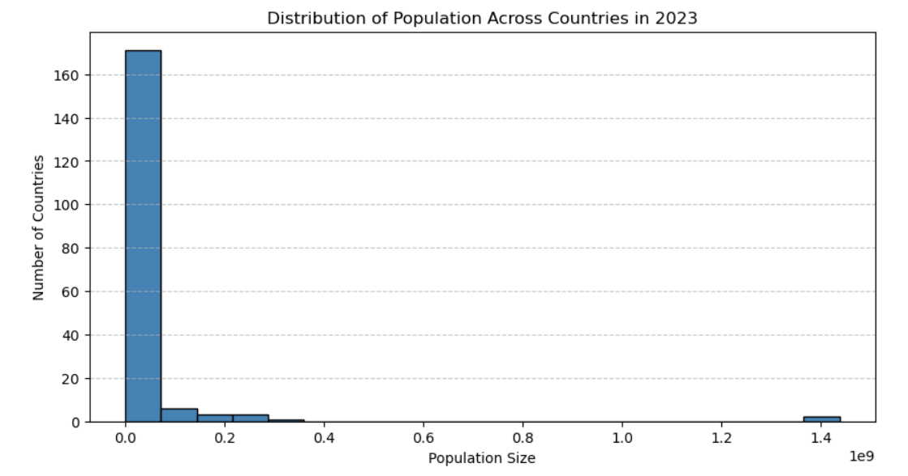

✅ 1. Project Name and Description
Project Name: World Population Analysis
Description:
A data analysis project focused on exploring global population trends using Python. 
The project includes loading, cleaning, and visualizing data to uncover insights about 
population distribution, growth patterns, and rankings across countries and continents.

🚀 2. Features
Analyze global population data
Visualize top 15 and bottom 15 populous countries
Continent-wise population distribution
Growth trends over the years
Clean, modular Jupyter Notebook format

💡 3. Usage Examples
Identify which countries have the highest and lowest population
Visualize population growth over time
Compare populations across continents

🧰 4. Technologies Used
Python
Jupyter Notebook
Pandas
Matplotlib
pycountry

📊 Population Analysis Visualizations

**Top 15 Most Populous Countries in 2023**

---

**Top 15 Most Populous Countries in 1990**

---

**Bottom 15 Least Populous Countries in 2023**

---

**Bottom 15 Least Populous Countries in 1990**

---

**Histogram of Population Distribution**

